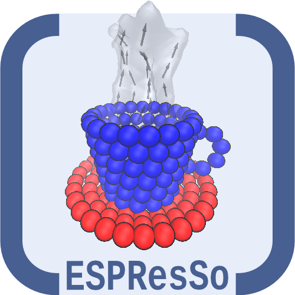
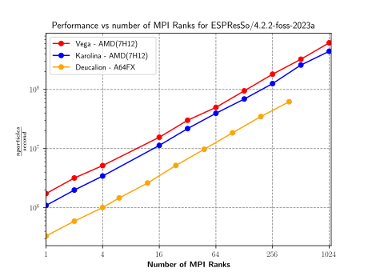
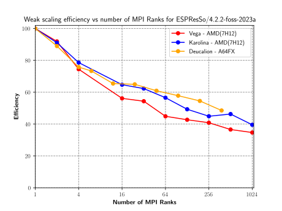

# Portable test run of ESPResSo on EuroHPC systems via EESSI

<figure markdown="span">
{width=30%}
</figure>

Since 14 June 2024, [ESPResSo](https://espressomd.org) v4.2.2 is available in the EESSI production repository `software.eessi.io`,
optimized for the [8 CPU targets](https://www.eessi.io/docs/software_layer/cpu_targets) that are fully supported by version 2023.06 of EESSI.
This allows running ESPResSo effortlessly on the EuroHPC systems where EESSI is already available,
like [Vega](https://doc.vega.izum.si) and [Karolina](https://docs.it4i.cz/karolina/introduction).

On 27 June 2024, an additional installation of ESPResSo v4.2.2 that is optimized for Arm A64FX processors
was added, which enables also running ESPResSo efficiently on [Deucalion](https://docs.macc.fccn.pt/deucalion),
even though EESSI is not available yet system-wide on Deucalion (see below for more details).

With the [portable test for ESPResSo](https://www.eessi.io/docs/test-suite/available-tests/#espresso) that is available
in the [EESSI test suite](https://www.eessi.io/docs/test-suite) we can easily evaluate the scalability of
ESPResSo across EuroHPC systems, even if those systems have different system architectures.

<!-- more -->

## Simulating Lennard-Jones fluids using ESPResSo

[Lennard-Jones fluids](https://en.wikipedia.org/wiki/Lennard-Jones_potential) model interacting soft spheres with a potential that is weakly attractive at medium range and strongly repulsive at short range. Originally designed to model noble gases, this simple setup now underpins most particle-based simulations, such as ionic liquids, polymers, proteins and colloids, where strongly repulsive pairwise potentials are desirable to prevent particles from overlapping with one another. In addition, solvated systems with atomistic resolution typically have a large excess of solvent atoms compared to solute atoms, thus Lennard-Jones interactions tend to account for a large portion of the simulation time. Compared to other potentials, the Lennard-Jones interaction is inexpensive to calculate, and its limited range allows us to partition the simulation domain into arbitrarily small regions that can be distributed among many processors.

## Portable test to evaluate performance of ESPResSo

To evaluate the performance of ESPResSo, we have implemented a *portable test* for ESPResSo in the [EESSI test suite](https://www.eessi.io/docs/test-suite);
the results shown here were collected using [version 0.3.2](https://github.com/EESSI/test-suite/releases/tag/v0.3.2).

After [installing and configuring](https://www.eessi.io/docs/test-suite/installation-configuration) the EESSI test suite on Vega, Karolina, and Deucalion,
running the Lennard-Jones (LJ) test case with ESPResSo 4.2.2 available in EESSI can be done with:

```bash
reframe --name "ESPRESSO_LJ.*%module_name=ESPResSo/4.2.2"
```

This will automatically run the LJ test case with ESPResSo across all known [scales](https://www.eessi.io/docs/test-suite/usage/#scale-tags)
in the EESSI test suite, which range from single core up to 8 full nodes.

## Performance + scalability results on Vega, Karolina, Deucalion

The performance results of the tests are collected by ReFrame in a [detailed JSON report](https://reframe-hpc.readthedocs.io/en/stable/tutorial.html#run-reports-and-performance-logging).

The parallel performance of ESPResSo, expressed in particles integrated per second, scales linearly with the number of cores.
On Vega using 8 nodes (1024 MPI ranks, one per physical core), ESPResSo 4.2.2 can integrate the equations of motion of roughly 615 million particles every second.
On Deucalion using 8 nodes (384 cores), we observe a performance of roughly 62 million particles integrated per second.

<figure markdown="span">
{width=100%}
</figure>

Plotting the parallel efficiency of ESPResSo 4.2.2 (weak scaling, 2000 particles per MPI rank) on the three EuroHPC systems we used
shows that it decreases approximately linearly with the logarithm of the number of cores.

<figure markdown="span">
{width=100%}
</figure>

---

## Running ESPResSo on Deucalion via EESSI + `cvmfsexec`

While EESSI is already available system-wide on both Vega and Karolina for some time (see
[here](https://doc.vega.izum.si/eessi) and [here](https://docs.it4i.cz/software/eessi) for more information,
respectively),
it was not available yet on Deucalion when these performance experiments were run.

Nevertheless, we were able to leverage the optimized installation of ESPResSo for A64FX that is available
in EESSI since 27 June 2024, by leveraging the [`cvmfsexec`](https://github.com/cvmfs/cvmfsexec) tool,
and by creatively implementing two simple shell wrapper scripts.

### `cvmfsexec` wrapper script

The first wrapper script `cvmfsexec_eessi.sh` can be used to run a command in a subshell in which
the EESSI [CernVM-FS](https://cernvm.cern.ch/fs) repository (`software.eessi.io`) is mounted via `cvmfsexec`.
This script can be used by regular users on Deucalion, it does not require any special privileges beyond
the Linux kernel features that `cvmfsexec` leverages, like [user namespaces](https://lwn.net/Articles/532593/).

Contents of `~/bin/cvmfsexec_eessi.sh`:
``` { .bash .copy }
#!/bin/bash
if [ -d /cvmfs/software.eessi.io ]; then
    # run command directly, EESSI CernVM-FS repository is already mounted
    "$@"
else
    # run command via in subshell where EESSI CernVM-FS repository is mounted,
    # via cvmfsexec which is set up in a unique temporary directory
    orig_workdir=$(pwd)
    mkdir -p /tmp/$USER
    tmpdir=$(mktemp -p /tmp/$USER -d)
    cd $tmpdir
    git clone https://github.com/cvmfs/cvmfsexec.git > $tmpdir/git_clone.out 2>&1
    cd cvmfsexec
    ./makedist default > $tmpdir/cvmfsexec_makedist.out 2>&1
    cd $orig_workdir
    $tmpdir/cvmfsexec/cvmfsexec software.eessi.io -- "$@"
    # cleanup
    rm -rf $tmpdir
fi
```

Do make sure that this script is executable:
``` { .bash .copy }
chmod u+x ~/bin/cvmfsexec_eessi.sh
```

A simple way to test this script is to use it to inspect the contents of the EESSI repository:

``` { .bash .copy }
~/bin/cvmfsexec_eessi.sh ls /cvmfs/software.eessi.io
```

or to start an interactive shell in which the EESSI repository is mounted:

``` { .bash .copy }
~/bin/cvmfsexec_eessi.sh /bin/bash -l
```

The job scripts that were submitted by ReFrame on Deucalion leverage `cvmfsexec_eessi.sh` to set up the
environment and get access to the ESPResSo v4.2.2 installation that is available in EESSI (see below).

### `orted` wrapper script

In order to get multi-node runs of ESPResSo working without having EESSI available system-wide,
we also had to create a small wrapper script for the [`orted`
command](https://www.open-mpi.org/doc/v4.1/man1/orted.1.php) that is used by [Open MPI](https://www.open-mpi.org)
to start processes on remote nodes.
This is necessary because `mpirun` launches `orted`, which must be run in an environment in which the EESSI repository
is mounted.
If not, MPI startup will fail with an error like "`error: execve(): orted: No such file or directory`".

This wrapper script must be named `orted`, and must be located in a path that is listed in `$PATH`.

We placed it in `~/bin/orted`, and add `export PATH=$HOME/bin:$PATH` to our `~/.bashrc` login script.

Contents of `~/bin/orted`:

``` { .bash .copy }
#!/bin/bash

# first remove path to this orted wrapper from $PATH, to avoid infinite loop
orted_wrapper_dir=$(dirname $0)
export PATH=$(echo $PATH | tr ':' '\n' | grep -v $orted_wrapper_dir | tr '\n' ':')

~/bin/cvmfsexec_eessi.sh orted "$@"
```

Do make sure that also this `orted` wrapper script is executable:
``` { .bash .copy }
chmod u+x ~/bin/orted
```

If not, you will likely run into an error that starts with:
```
An ORTE daemon has unexpectedly failed after launch ...
```

### Slurm job script

We can use the `cvmfsexec_eessi.sh` script in a Slurm job script on Deucalion to
initialize the EESSI environment in a subshell in which the EESSI CernVM-FS repository
is mounted, and subsequently load the module for ESPResSo v4.2.2 and launch the Lennard-Jones fluid
simulation via `mpirun`:


Job script (example using 2 full 48-core nodes on A64FX partition of Deucalion):
``` { .bash .copy }
#!/bin/bash
#SBATCH --ntasks=96
#SBATCH --ntasks-per-node=48
#SBATCH --cpus-per-task=1
#SBATCH --time=5:0:0
#SBATCH --partition normal-arm
#SBATCH --export=None
#SBATCH --mem=30000M
~/bin/cvmfsexec_eessi.sh << EOF
export EESSI_SOFTWARE_SUBDIR_OVERRIDE=aarch64/a64fx
source /cvmfs/software.eessi.io/versions/2023.06/init/bash
module load ESPResSo/4.2.2-foss-2023a
export SLURM_EXPORT_ENV=HOME,PATH,LD_LIBRARY_PATH,PYTHONPATH
mpirun -np 96 python3 lj.py
EOF
```

*(the `lj.py` Python script is available in the EESSI test suite, see [here](https://github.com/EESSI/test-suite/blob/v0.3.2/eessi/testsuite/tests/apps/espresso/src/lj.py))*

