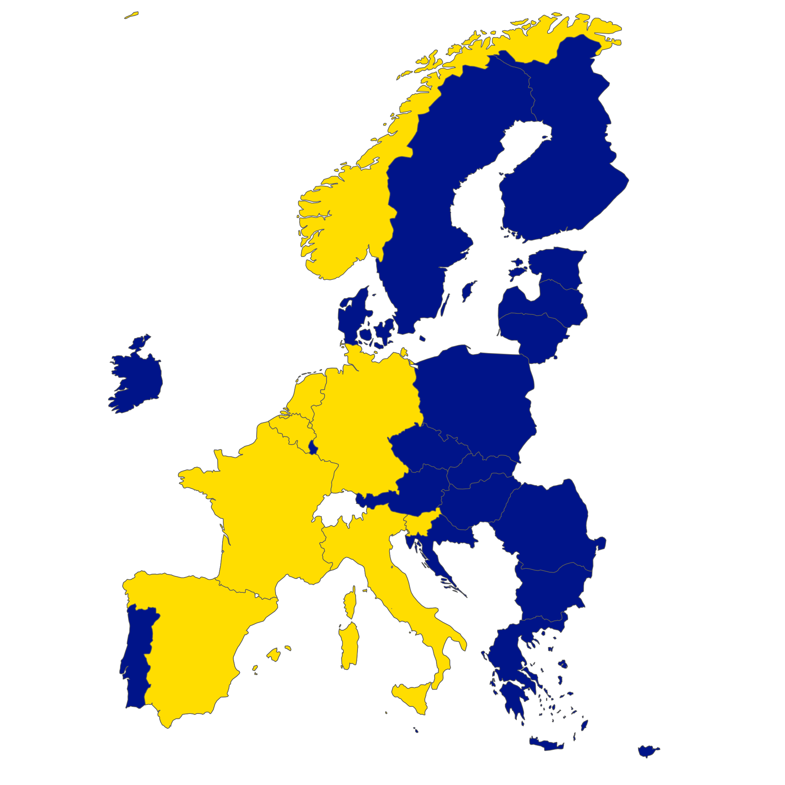

# CI workflow for EESSI

[EESSI's CI workflows](https://www.eessi.io/docs/using_eessi/eessi_in_ci/) are available on [GitHub Actions](https://github.com/marketplace/actions/eessi) and as a [GitLab CI/CD component](https://gitlab.com/explore/catalog/eessi/gitlab-eessi). Enabling this is as simple as adding EESSI's CI to your workflow of choice, giving you access to the entire EESSI software stack optimized for the relevant CPU architecture(s) in your runner's environment. If you are developing an application on top of the EESSI software stack, for example, this means you don't need to invest heavily in configuring and maintaining a CI setup: EESSI does that for you so you can focus on your code. With the EESSI CI workflows you don't have to worry ab to worry about figuring out how to optimize build and runtime dependencies as these will be streamed seamlessly to your runner's environment.

<!-- more -->

## Using the CI component in GitLab

To showcase this, let's create a simple `R` package that just outputs a map of the European Union and Norway, and colours the participating countries in the [MultiXscale CoE](https://multixscale.eu).

We'll make a package [`eessirmaps`](https://gitlab.com/neves-p/eessirmaps) that relies on popular R packages [`ggplot2`](https://cran.r-project.org/package=ggplot2), [`sf`](https://cran.r-project.org/package=sf), and [`rnaturalearth`](https://cran.r-project.org/package=rnaturalearth) to render and save this map. Installing GIS tools for R can be somewhat cumbersome, which could become trickier if it has to be done in a CI environment. This is because `sf` requires system packages `libgdal-dev` and `libproj-dev`, which would add yet another step, complicating our CI workflow. Thankfully, EESSI makes a lot of the packages dependencies available to us from the start, as well as a fully functioning version of R, and the necessary package dependencies to boot!. As far as setup goes, this results in a simple CI workflow:

``` yml
include:
  - component: $CI_SERVER_FQDN/eessi/gitlab-eessi/eessi@1.0.5

build:
  stage: build
  artifacts:
    paths:
      - msx_map.png
  script:
    # Create directory for personal R library
    - mkdir $CI_BUILDS_DIR/R
    - export R_LIBS_USER=$CI_BUILDS_DIR/R
    # Load the R module from EESSI
    - module load R-bundle-CRAN/2023.12-foss-2023a
    # Install eessirmaps, the rnaturalearth dep and create the plot
    - R -e "install.packages('rnaturalearthdata', repos = 'https://cran.rstudio.com/');
      remotes::install_gitlab('neves-p/eessirmaps', upgrade = FALSE);
      eessirmaps::multixscale_map(); ggplot2::ggsave('msx_map.png', bg = 'white')"
```

Note how we simply include the EESSI GitLab CI component and set up a blank directory for our user R libraries. Remember, because of EESSI, the environment that you develop in will be _exactly_ the same as the one the CI is run in. Apart from the [`rnaturalearthdata`](https://cran.r-project.org/package=rnaturalearthdata) R package, all the other dependencies are taken care of by the `R-bundle-CRAN/2023.12-foss-2023a` EESSI module. This is true for the system and R package dependencies.

Then we simply have to install our package to the CI environment and call the `multixscale_map()` function to produce the plot, which is uploaded as an artifact from the CI environment. We can then retrieve the [artifact archive](https://gitlab.com/neves-p/eessirmaps/-/jobs/8057216299/artifacts/download), unpack it and obtain the map.

<figure markdown="span">

</figure>


